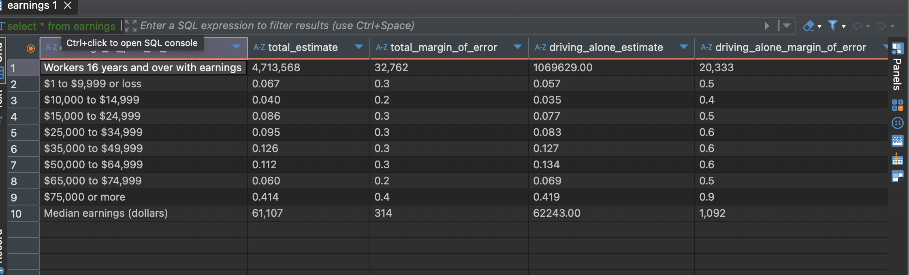

# PostgreSQL Setup Scripts: Import Raw Data, Create Schema, Define Types

Table Created:

### 1. `earnings`

```sql
create table earnings (
earnings_in_past_12_months VARCHAR,
total_estimate VARCHAR,
total_margin_of_error VARCHAR,
driving_alone_estimate VARCHAR,
driving_alone_margin_of_error VARCHAR,
carpooled_estimate VARCHAR,
carpooled_margin_of_error VARCHAR,
public_transportation_estimate VARCHAR,
public_transportation_margin_of_error VARCHAR,
worked_from_home_estimate VARCHAR,
worked_from_home_margin_of_error VARCHAR
);
```
This table provides detailed data on how people in New York City travel to work based on their earnings. 

## Exploratory Data Analysis (EDA) 

```sql
--Null counts per column 
SELECT
  COUNT(*) FILTER (WHERE earnings_in_past_12_months IS NULL) AS null_earnings_in_past_12_months,
  COUNT(*) FILTER (WHERE total_estimate IS NULL) AS null_total_estimate,
  COUNT(*) FILTER (WHERE total_margin_of_error IS NULL) AS null_total_margin_of_error,
  COUNT(*) FILTER (WHERE driving_alone_estimate IS NULL) AS null_driving_alone_estimate,
  COUNT(*) FILTER (WHERE driving_alone_margin_of_error IS NULL) AS null_driving_alone_margin_of_error
FROM class_of_worker cow  ;
```


```sql 
SELECT
  COUNT(*) FILTER (WHERE earnings_in_past_12_months IS NULL) AS null_earnings_in_past_12_months,
  COUNT(*) FILTER (WHERE total_estimate IS NULL) AS null_total_estimate,
  COUNT(*) FILTER (WHERE total_margin_of_error IS NULL) AS null_total_margin_of_error,
  COUNT(*) FILTER (WHERE driving_alone_estimate IS NULL) AS null_driving_alone_estimate,
  COUNT(*) FILTER (WHERE driving_alone_margin_of_error IS NULL) AS null_driving_alone_margin_of_error
FROM earnings e ;
```


### 2. `tax_returns`

```sql
CREATE TABLE public.tax_returns (
	statefips integer,
	state varchar(2),
	zipcode varchar,
	agi_stub integer,
	n1 integer,
	n2 integer,
	mars1 numeric,
	mars2 numeric,
	mars4 numeric,
	PRIMARY KEY (state, zipcode, agi_stub)
);
```
This table gives the agi stub for all the zip codes in New York City. 

```sql 
select * from tax_returns tr 
```


