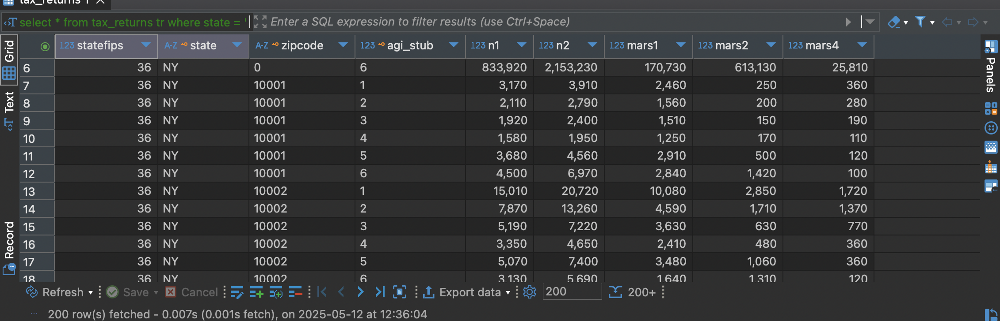

#  Means of Transportation to Work S0804 
## PostgreSQL Setup Scripts: Import Raw Data, Create Schema, Define Types

Table Created:
#### 1. `so804`

CREATE TABLE so804 (
    label TEXT,
    total_estimate VARCHAR,
    total_margin_of_error VARCHAR,
    drove_alone_estimate VARCHAR,
    drove_alone_margin_of_error VARCHAR,
    carpooled_estimate VARCHAR,
    carpooled_margin_of_error VARCHAR,
    public_transportation_estimate VARCHAR,
    public_transportation_margin_of_error VARCHAR,
    worked_from_home_estimate VARCHAR,
    worked_from_home_margin_of_error VARCHAR
);

This table provides detailed data on how people in New York City commute to work, broken down by means of transportation. 

## Exploratory Data Analysis (EDA) 

select * from so804;

SELECT
  COUNT(*) FILTER (WHERE label IS NULL) AS label_null,
  COUNT(*) FILTER (WHERE total_estimate IS NULL) AS total_estimate_null,
  COUNT(*) FILTER (WHERE total_margin_of_error IS NULL) AS null_total_margin_of_error,
  COUNT(*) FILTER (WHERE drove_alone_estimate IS NULL) AS null_drove_alone_estimate,
  COUNT(*) FILTER (WHERE drove_alone_margin_of_error IS NULL) AS null_drove_alone_moe,
  COUNT(*) FILTER (WHERE carpooled_estimate IS NULL) AS null_carpooled_estimate,
  COUNT(*) FILTER (WHERE public_transportation_estimate IS NULL) AS null_public_transportation_estimate
  from so804;
 

