# SQL Scripts

**zip_to_city table**
```sql
create table public.zip_to_city (
	borough varchar,
	city varchar,
	zipcode varchar,
	primary key (zipcode)
);

COPY zip_to_city FROM '/Users/justinespinal/Desktop/zip_to_city.csv' WITH (FORMAT csv, HEADER, DELIMITER ',');

select * from zip_to_city;
```
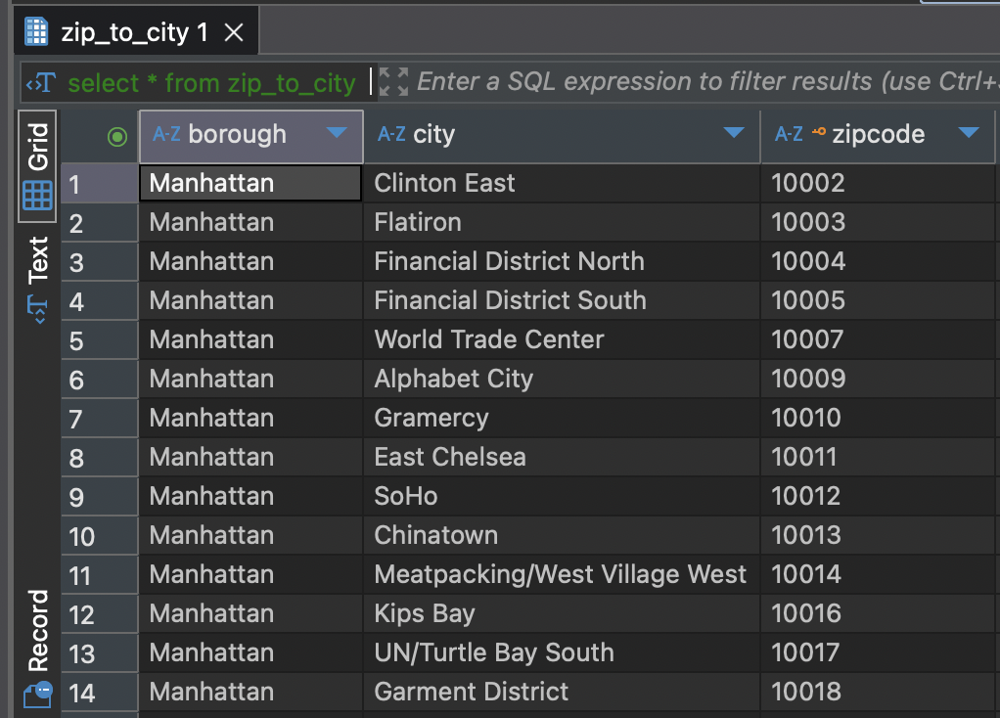

**NYC_Zips Code Table**
```sql
create table NYC_Zips as
with NYC_Zips_CTE as (
	select tr.zipcode, zc.borough, zc.city, tr.agi_stub, n1 as households	
	from tax_returns tr join zip_to_city zc on tr.zipcode = zc.zipcode
	where tr.state = 'NY'
)
select * from NYC_Zips_CTE;

select * from NYC_Zips;
```
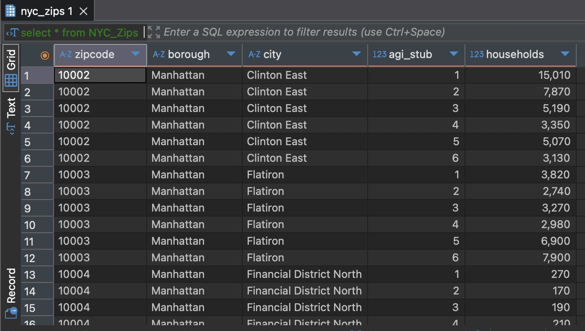

**earnings_table** s0804
```sql
create table earnings (
earnings_in_past_12_months VARCHAR,
total_estimate VARCHAR,
total_margin_of_error VARCHAR,
driving_alone_estimate VARCHAR,
driving_alone_margin_of_error VARCHAR,
carpooled_estimate VARCHAR,
carpooled_margin_of_error VARCHAR,
public_transportation_estimate VARCHAR,
public_transportation_margin_of_error VARCHAR,
worked_from_home_estimate VARCHAR,
worked_from_home_margin_of_error VARCHAR
);

COPY earnings FROM '/Users/justinespinal/Desktop/earnings.csv' WITH (FORMAT csv, HEADER, DELIMITER ',');
```
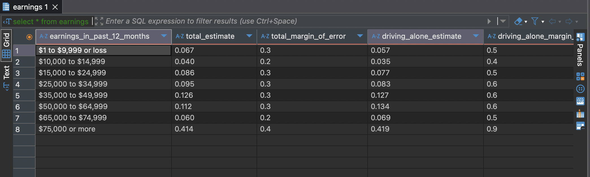

**earnings_grouped view**
```sql
CREATE TABLE earnings_grouped AS
SELECT
  CASE
    WHEN "earnings_in_past_12_months" IN (
      '$1 to $9,999 or loss',
      '$10,000 to $14,999',
      '$15,000 to $24,999'
    ) THEN 1
    WHEN "earnings_in_past_12_months" IN (
      '$25,000 to $34,999',
      '$35,000 to $49,999'
    ) THEN 2
    WHEN "earnings_in_past_12_months" IN (
      '$50,000 to $64,999',
      '$65,000 to $74,999'
    ) THEN 3
    WHEN "earnings_in_past_12_months" = '$75,000 or more' THEN 4
    ELSE NULL
  END AS earnings_group,
  SUM(CAST(REPLACE("total_estimate", ',', '') AS FLOAT)) AS total_estimate,
  SUM(CAST(REPLACE("public_transportation_estimate", ',', '') AS FLOAT)) AS public_transportation_estimate,
  SUM(CAST(REPLACE("driving_alone_estimate", ',', '') AS FLOAT)) AS driving_alone_estimate
FROM earnings
WHERE "earnings_in_past_12_months" IN (
  '$1 to $9,999 or loss',
  '$10,000 to $14,999',
  '$15,000 to $24,999',
  '$25,000 to $34,999',
  '$35,000 to $49,999',
  '$50,000 to $64,999',
  '$65,000 to $74,999',
  '$75,000 or more'
)
GROUP BY earnings_group;
```
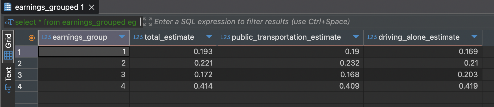

**zip_earnings table** (s0804 -> NYC_Zips)
```sql
create table zip_earnings as
with zip_earnings_cte as (
	SELECT
	  z.zipcode,
	  z.borough,
	  z.city,
	  z.agi_stub,
	  e.earnings_group,
	  e.total_estimate,
	  e.public_transportation_estimate,
	  e.driving_alone_estimate
	FROM NYC_Zips AS z
	LEFT JOIN earnings_grouped AS e
	  ON e.earnings_group = CASE
	    WHEN z.agi_stub <= 4 THEN z.agi_stub
	    ELSE 4
	  END
)
select * from zip_earnings_cte;

select * from zip_earnings;
-- s0804 (earnings) -> NYC_Zips
```
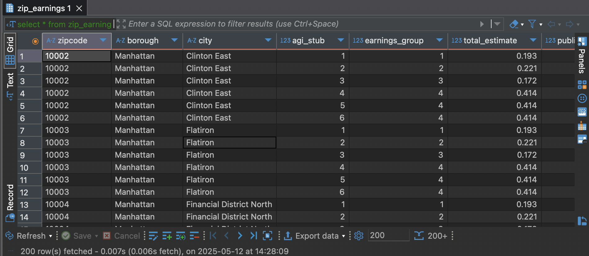

**fhv_trip and taxi_zone_lookup**
```sql
CREATE TABLE fhv_trip (
    dispatching_base_num VARCHAR,
    pickup_datetime TIMESTAMP,  --timestamp using data and time: ‘2023-01-01 01:00:00’
    dropoff_datetime TIMESTAMP,
    pulocationid INT,
    dolocationid INT,
    sr_flag BOOLEAN,
    affiliated_base_number VARCHAR,
    FOREIGN KEY (pulocationid) REFERENCES taxi_zone_lookup(locationid),
    FOREIGN KEY (dolocationid) REFERENCES taxi_zone_lookup(locationid)
);

CREATE TABLE taxi_zone_lookup (
    locationid INT PRIMARY KEY,
    borough VARCHAR,
    zone VARCHAR,
    service_zone VARCHAR
);

COPY taxi_zone_lookup FROM '/Users/justinespinal/Desktop/taxi_zone_lookup.csv' WITH (FORMAT csv, HEADER, DELIMITER ',');

COPY fhv_trip FROM '/Users/justinespinal/Desktop/fhv.csv' WITH (FORMAT csv, HEADER, DELIMITER ',');
```
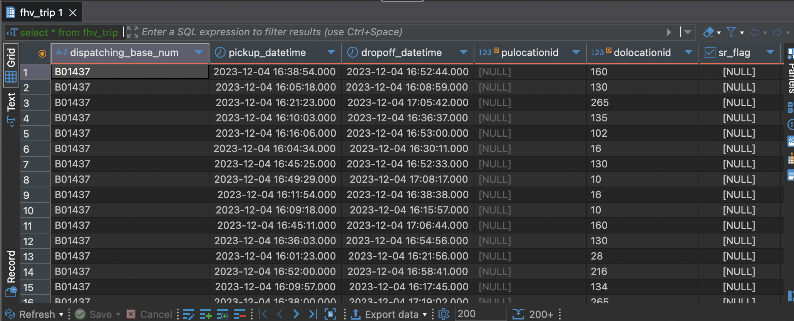
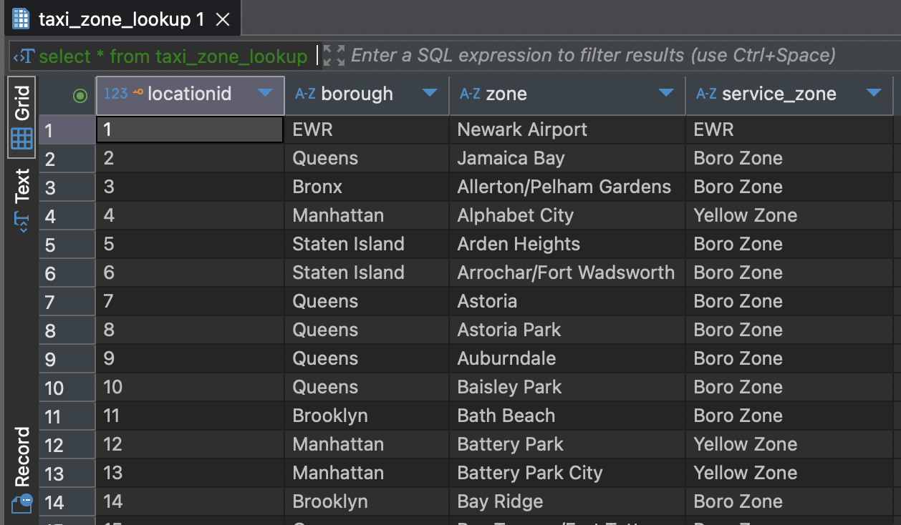

**trip_with_zones**
```sql
create table trip_with_zones as
WITH trip_with_zones_cte AS (
  SELECT
    ft.pickup_datetime,
    ft.dropoff_datetime,
    pu.borough AS pickup_borough,
    pu.zone AS pickup_zone
  FROM fhv_trip ft
  JOIN taxi_zone_lookup pu ON ft.pulocationid = pu.locationid
)
SELECT * FROM trip_with_zones_cte;
```
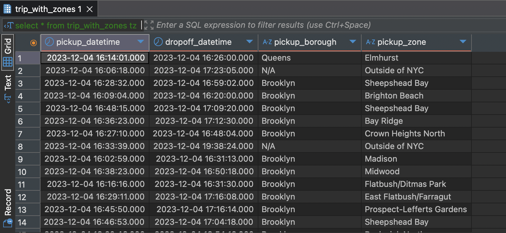

**daily_pickup_avg**
```sql
CREATE TABLE daily_pickup_avg AS
with daily_pickup_avg_cte AS (
  SELECT
    pickup_borough,
    pickup_zone,
    COUNT(*) AS total_trips,
    ROUND(COUNT(*) / 365.0, 2) AS avg_daily_trips,
    ROUND(AVG(EXTRACT(EPOCH FROM (dropoff_datetime - pickup_datetime)) / 60), 2) AS avg_trip_duration_min
  FROM trip_with_zones
  WHERE pickup_datetime IS NOT NULL AND dropoff_datetime IS NOT NULL
  GROUP BY pickup_borough, pickup_zone
)
SELECT * FROM daily_pickup_avg_cte;

select * from daily_pickup_avg;
```
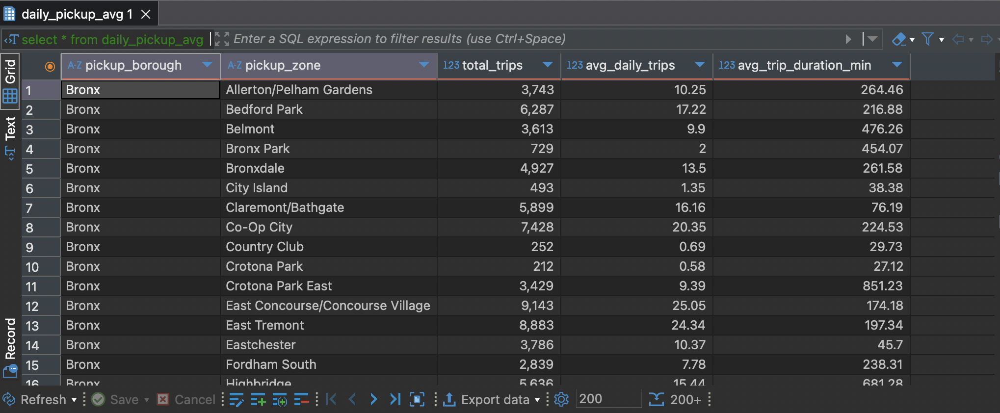

**fhv_zip**
```sql
create table fhv_zip as
with fhv_zip_cte as (
	select zipcode, borough, city, agi_stub, households, total_trips, avg_daily_trips, avg_trip_duration_min 
	from daily_pickup_avg da join NYC_Zips nz on (nz.borough = da.pickup_borough and nz.city = da.pickup_zone)
)
select * from fhv_zip_cte;

select * from fhv_zip;
```
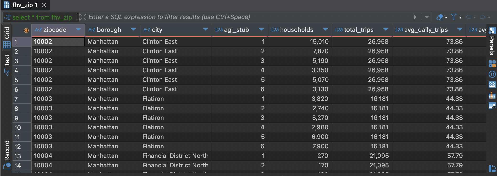

**fhv_zip_earnings**
```sql
create table fhv_zip_earnings as
with fhv_zip_earnings_cte as (
	SELECT fz.zipcode, fz.borough, fz.city, fz.agi_stub, fz.households, fz.total_trips, fz.avg_daily_trips, fz.avg_trip_duration_min, ze.total_estimate, ze.public_transportation_estimate, ze.driving_alone_estimate
	FROM fhv_zip fz
	JOIN zip_earnings ze
  		ON fz.zipcode = ze.zipcode
 		AND fz.agi_stub = ze.agi_stub
)
select * from fhv_zip_earnings_cte;

select * from fhv_zip_earnings;
```
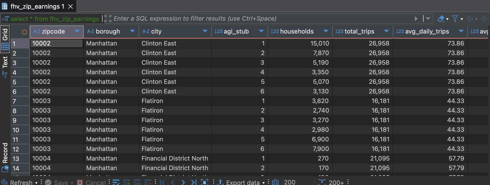